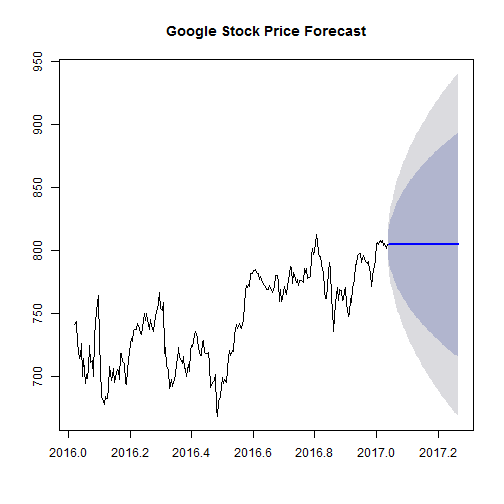
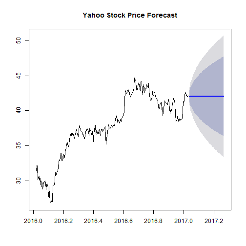

Week4_Assignment - Stock Forecast Tool for Google and Yahoo
========================================================
author: Danielle Hu
date: 2017-01-20
autosize: true

Stock Forecast Tool for Google and Yahoo
========================================================
This application is a simple tool for forecasting stock price. Currently it only has google and yahoo stocks.

The forecast is based on the historical data from January 6, 2015 to January20, 2017. In the UI, there are radio button for selecting a stock and a slider for selecting how many days to forecast. The graph will display forecast data based on your selections.

Prepare Stock Data
========================================================
Load csv data into dataframe and convert it to the ts class


```r
require(zoo)
library(xts)
library(forecast)

#load google data
goog.data <- read.csv("goog.csv")
goog.data$Date <- as.Date(as.character(goog.data$Date),format="%Y-%m-%d")
goog.x <- xts(x=goog.data$Close, order.by = goog.data$Date)
goog.x.ts <- ts(goog.x, freq=260, start=c(2016, 6))

#load yahoo data
yahoo.data <- read.csv("yahoo.csv")
yahoo.data$Date <- as.Date(as.character(yahoo.data$Date),format="%Y-%m-%d")
yahoo.x <- xts(x=yahoo.data$Close, order.by = yahoo.data$Date)
yahoo.x.ts <- ts(yahoo.x, freq=260, start=c(2016, 6))
```

Forecast Google Stock Price
========================================================
Forecast Google stock price for next 60 days

```r
plot(forecast(ets(goog.x.ts), 60), main="Google Stock Price Forecast", axes = TRUE)
```




Forecast Yahoo Stock Price
========================================================
Forecast Google stock price for next 60 days

```r
plot(forecast(ets(yahoo.x.ts), 60), main="Yahoo Stock Price Forecast", axes = TRUE)
```


